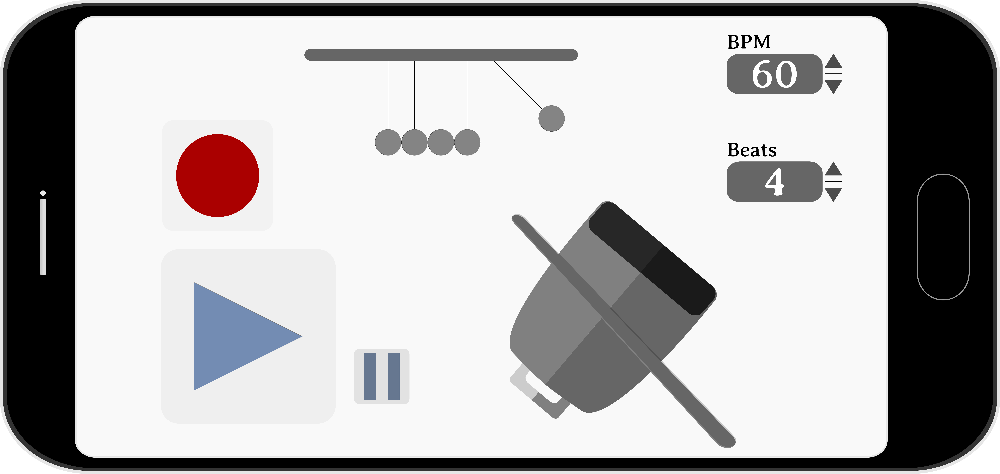

## overview

fazer um *app* similar a um metrônomo mas que é focado não no pulso e sim na clave rítmica (padrão rítmico) possibilitando ao usuário "gravar" a clave dentro de uma quantidade finita de pulsos (compassos) com posterior reprodução em *looping* do que foi gravado.

o *app* vai ter 3 funcionalidades principais:

	1. um pêndulo de Newton para contar o pulso (BPM)
 	2. um *cowbell* para gravar o ritmo
 	3. controle de reprodução (*play* e *pause*) do ritmo tocado

### pêndulo de Newton

- o pêndulo deve se mover a uma velocidade constante expressa em BPM (20 ~ 600) e precisa haver uma marcação que represente o *looping* dos pulsos
- tocar na imagem do pêndulo faz ele iniciar ou parar a contagem que pode ficar pra sempre (como um metrônomo tradicional, mas precisa ter indicação de 0 pulsos) ou como guia para a gravação do ritmo sendo que os 3 primeiros pulsos ficam sempre como contagem para começar a gravar. (precisa haver uma indicação visual para indicar a gravação)

### gravação da clave

- haverá um botão para entrar em modo de gravação
- a gravação sempre se inicia após a contagem de 3 pulsos e tem a duração definida pelo usuário
- o ritmo será gravado por toques na tela sobre a imagem de um *cowbell*
- no caso de anacruse deve-se começar pensando pela cabeça do tempo forte subsequente deixando o anacruse no último compasso
- durante a gravação do ritmo todos os controles ficam inativos, somente o *cowbell* funciona

### reprodução

- haverá apenas os botões de *play* e *pause*
- o app só contará com o *cache* temporário, a princípio não poderão ser salvos ritmos (posterior modelo freemium) em banco de dados

## MVC

